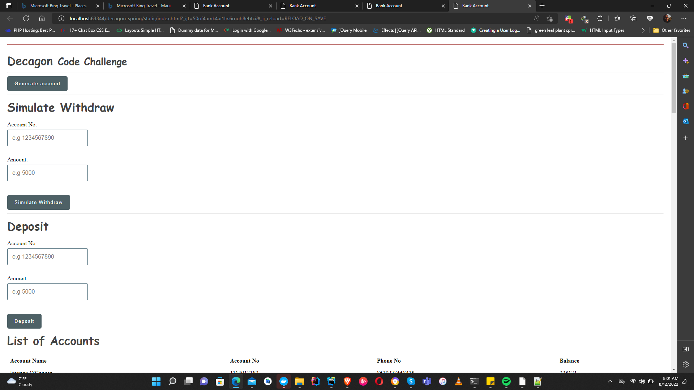
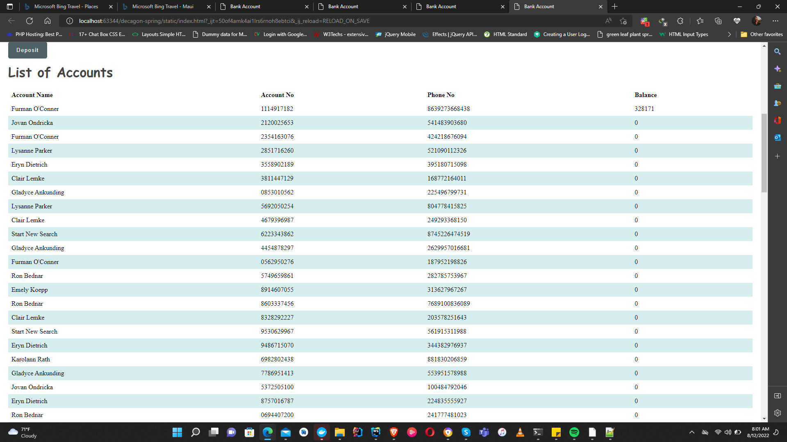
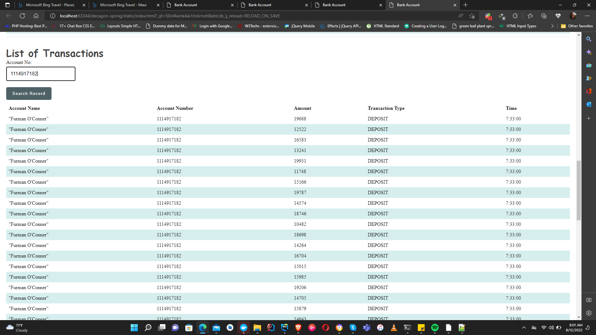

Launch Application on IDE or using docker 

To access the index page go to the base url of the application (http://localhost:8779/) on your browser

### Sample request
POST http://localhost:8779/api/v1/account/create
Content-Type: application/json

{
"accountName": "Uzumaki Naruto",
"phoneNo": "08045593731"
}

### Sample reaponse
3661184314

### Sample Requests
POST http://localhost:8779/api/v1/account/deposit
Content-Type: application/json

{
"accountNo": "3661184314",
"amount": 50000
}
### Sample Response

{
"amount": "50000",
"balance": 50000.0
}

### Sample Request
POST http://localhost:8779/api/v1/account/withdraw
Content-Type: application/json

{
"accountNo": "3661184314",
"amount": 6000
}

### Sample Response

{
"amount": "6000",
"balance": 44000.0
}

### Request
GET http://localhost:8779/api/v1/account/transactions?accountNo=

### Response
[{
"accountName": "Uzumaki Naruto",
"accountNumber": "3661184314",
"amount": 50000.0,
"transactionType": "DEPOSIT",
"createdAt": "2022-08-11T18:59:23.2345473"
},

{
"accountName": "Uzumaki Naruto",
"accountNumber": "3661184314",
"amount": 6000.0,
"transactionType": "WITHDRAWAL",
"createdAt": "2022-08-11T18:59:54.0338555"
}
]

